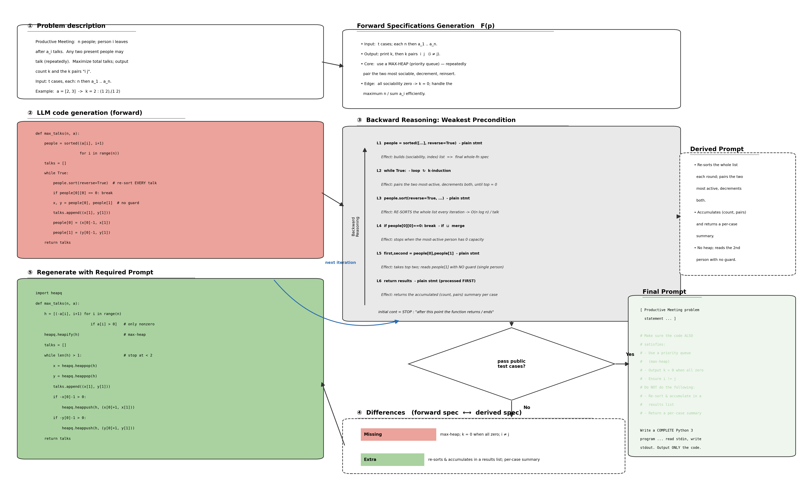
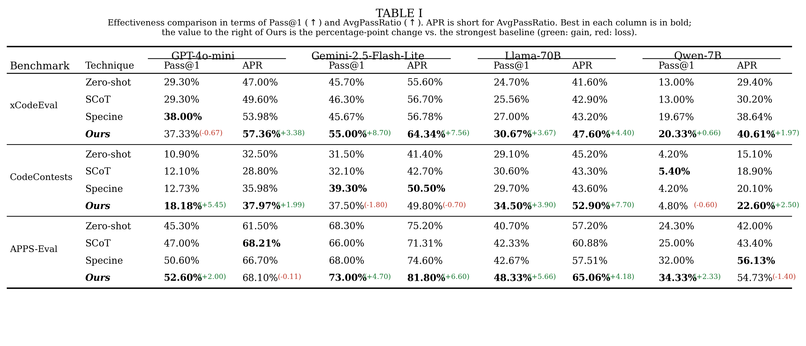
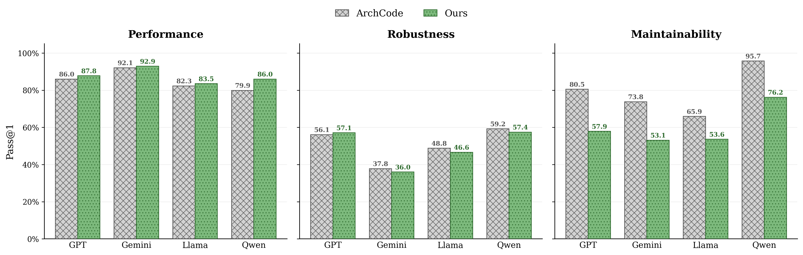
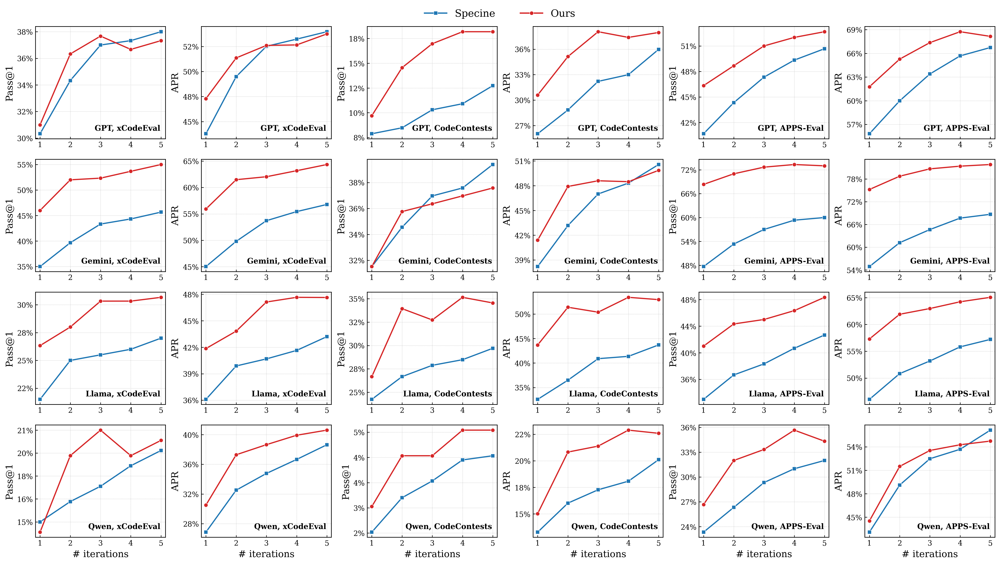
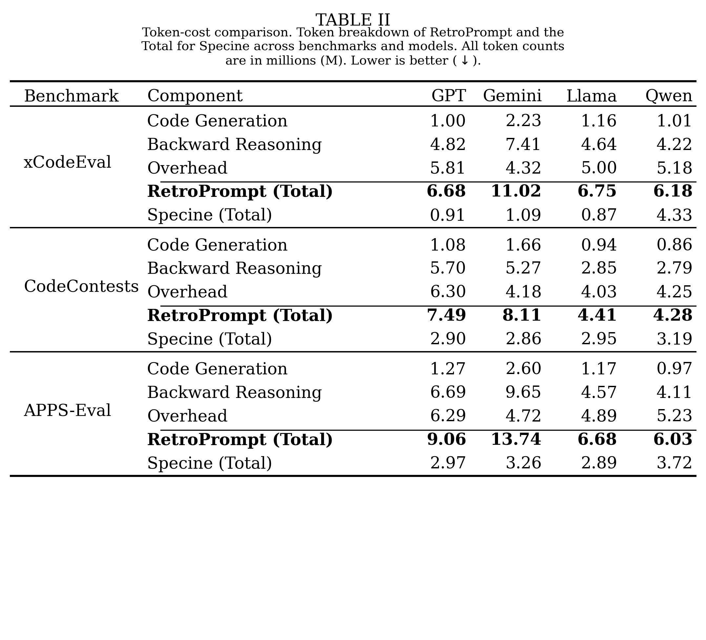

# RetroPrompt: Prompt Refinement for LLM Code Generation via Backward Reasoning

This repository contains the anonymized implementation of **RetroPrompt**, an iterative
prompt-refinement framework for LLM-based code generation. Instead of judging generated code
only by executing tests, RetroPrompt **reasons backward** through the program to recover, in
natural language, what the code actually implements, contrasts that recovered behavior with the
intended requirements, and folds the discrepancies back into the prompt. The loop repeats until
the code passes the public tests or an iteration budget is reached.

<p align="center">
  
</p>

## Approach

Given a natural-language task, RetroPrompt runs a fix-point refinement loop:

1. **Forward specification.** Extract an intended specification `(Pre, Post)` from the problem
   (valid inputs + required functional and non-functional behaviors).
2. **Code generation.** Generate a candidate program from the current prompt.
3. **Backward reasoning.** Recover a natural-language behavioral summary of the candidate,
   statement by statement, deriving the weakest input condition under which each required
   behavior holds. Loops are summarized with *k*-bounded induction.
4. **Specification differencing.** Compare the recovered behavior against the intended
   specification to obtain the **missing** behaviors (required but absent) and the **extra**
   behaviors (present but unwanted).
5. **Prompt refinement.** Inject the differences as explicit `# must` (obligations) and
   `# avoid` (prohibitions) blocks appended to the original prompt.

A refined candidate is accepted only if it passes at least as many public tests as the best
candidate so far (hill-climbing acceptance), and the hidden tests are used **only** for final
scoring, never for refinement.

## Repository structure

```
.
├── retroprompt.py          # main engine: forward spec, generation, differencing, repair loop
├── backward_reasoning.py   # statement-level backward reasoning (weakest-precondition recovery)
├── code_executor.py        # sandboxed HTTP code-execution service used for grounding + scoring
├── zeroshot.py             # baseline: direct single-shot prompting
├── scot.py                 # baseline: Structured Chain-of-Thought prompting
├── data/                   # (create this; download datasets from Zenodo — not shipped)
├── figures/                # overview + result figures
└── requirements.txt
```

## Requirements

```bash
pip install -r requirements.txt
```

Python 3.10+. Core dependencies: `fire`, `requests`, `flask`, `radon`.

## Datasets

The datasets are hosted separately to keep this repository small. Create a `data/` directory in
the repository root and download all files (benchmarks and the one-shot in-context example
`humaneval_like.json`) from the anonymized archive into it:

> https://zenodo.org/records/21098931

## Setup

RetroPrompt calls LLMs through the OpenRouter API. Configure the provider and credentials via
environment variables (**no keys are stored in this repository**):

```bash
export PROVIDER=openrouter
export OPENROUTER_API_KEY=<your-key>          # supply your own key
# optional: pin a single serving provider for reproducibility
export OPENROUTER_PROVIDER=Together
```

Start the code-execution service (used for public-test grounding and hidden-test scoring):

```bash
python code_executor.py                        # serves on http://localhost:5097
# or, multi-worker:
# gunicorn -w 8 --bind 0.0.0.0:5097 code_executor:app
```

## Usage

Run RetroPrompt on a benchmark. The `curve` command reports Pass@1 and AvgPassRatio (APR) after
every refinement iteration:

```bash
python retroprompt.py curve \
    --benchmark=xcodeeval \
    --provider=openrouter \
    --model="qwen/qwen-2.5-7b-instruct" \
    --backward=structural \
    --grounding=public \
    --candidates=1 \
    --max_iters=5 \
    --n=300 \
    --workers=6 \
    --out=results/retroprompt_xcodeeval
```

Key flags:

| flag | meaning |
|---|---|
| `--benchmark` | `xcodeeval`, `code_contests`, `apps`, or `humaneval_nfr` |
| `--model` | any OpenRouter model id (e.g. `openai/gpt-4o-mini`, `google/gemini-2.5-flash-lite`, `meta-llama/llama-3.3-70b-instruct`, `qwen/qwen-2.5-7b-instruct`) |
| `--backward` | `structural` (statement-level backward reasoning) |
| `--grounding` | `public` (accept refinements only if public tests do not regress) or `none` |
| `--max_iters` | refinement iteration cap `N` (paper uses 5) |
| `--per_category` | for `humaneval_nfr`: also report the non-functional axes |

**Baselines:**

```bash
python zeroshot.py <benchmark> <model> openrouter <n> results/zeroshot_<benchmark>
python scot.py     <benchmark> <model> openrouter <n> results/scot_<benchmark>
```

## Results

**Effectiveness (Pass@1 / APR, %).** RetroPrompt improves Pass@1 over direct generation by
27.5% on average and attains the best result in 10 of 12 (model, benchmark) settings against the
strongest prior refinement baseline.

<p align="center">
  
</p>

**Non-functional requirements.** Against the NFR-aware baseline ArchCode, RetroPrompt improves
performance on all four models and stays competitive on robustness.

<p align="center">
  
</p>

**Influence of iterations.** Pass@1 increases monotonically with the iteration count; most of
the gain accrues in the first three iterations.

<p align="center">
  
</p>

**Token cost (millions, lower is better).** The backward-reasoning step dominates cost (~4x the
code-generation step).

<p align="center">
  
</p>

## License

This project is released under the MIT License. See the [LICENSE](LICENSE) file for details.
